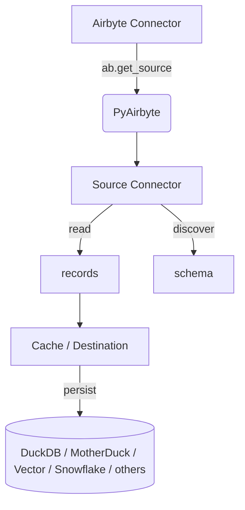

# PyAirbyte Fundamentals

## Introduction

PyAirbyte wraps the entire Airbyte connector catalogue in a friendly Python API. Instead of running the Airbyte platform you can pull data right inside a Jupyter/Colab notebook, a scheduled script, or a production service. In this course we will:

* Install and configure PyAirbyte.
* Build a pipeline that pulls data from Stripe into DuckDB.
* Persist data in MotherDuck and keep it incrementally updated.
* Run a custom manifest‑only connector built with the Airbyte Connector Builder.
* Load data into a vector database and run semantic queries (RAG).

Along the way we will cover secret management, caching options, and deployment tips.

###  Prerequisites

| Skill / Tool            | Minimum level                           |
| ----------------------- | --------------------------------------- |
| Python                  | Basic syntax & packages                 |
| GitHub or Google Colab  | Able to run notebooks                   |
| MotherDuck account      | Free tier is fine                       |

> [!Tip]
> All examples run in Colab so you can follow even on an iPad.


## What is PyAirbyte

PyAirbyte is a lightweight Python interface that lets you run any Airbyte connector directly inside your code. Instead of deploying the full Airbyte platform, you import a library, point it at a source, and start streaming JSON records into the storage option of your choice. The same connectors, schemas, and incremental‑state logic you would use in Airbyte Cloud are available locally, so you can prototype quickly and promote the exact pipeline to production without rewriting.

In short, PyAirbyte brings the Airbyte protocol to wherever Python runs—Jupyter notebooks, scheduled scripts, serverless functions, or long‑lived services—while staying fully compatible with the wider Airbyte ecosystem.

- **Batteries included** – 550 + source & destination connectors.
- **No heavyweight platform** – run from any Python runtime.
- **Declarative** – the API mirrors the Airbyte Connector Spec.
- **Composable** – mix‑and‑match caches, secret managers, and destinations.

### 3.1 How it works How it works



- The **source** streams JSON lines that follow the Airbyte Protocol.
- PyAirbyte writes them to a **cache** (Local DuckDB by default) or forwards them to a destination connector.
- State messages are stored so that the next run fetches only new or updated records (incremental sync).

### 3.2 Limitations

| **Feature**                | **PyAirbyte**                                          |
| -------------------------- | ------------------------------------------------------ |
| Orchestration / scheduling | ❌ – bring your own (GitHub Actions, Airflow, Dagster…) |
| Monitoring & alerting      | ❌ – You can configure it yourself                      |
| Transformations            | ✅ lightweight, Python‑side                             |

## PyAirbyte Data Pipelines 101

In this first practical exercise you will build a minimal yet complete pipeline that streams Stripe data into a local DuckDB cache from inside a Google Colab notebook. The same code can later be pasted into a plain Python file and scheduled from GitHub Actions or any orchestrator.

### Set up the environment

Create or open a new Colab notebook and install PyAirbyte:

```bash
# Prepare env and install PyAirbyte
!apt-get update && apt-get install -qq python3.11-venv
%pip install airbyte
```

Import the package to verify the installation:

```python
import airbyte as ab
```

### Explore the connector catalogue

PyAirbyte exposes a helper that lists every source and destination available in the Airbyte registry:

```python
available_sources = ab.get_available_connectors()

for source in available_sources:
    print(source)
```

Running `len(available_sources)` shows more than **550** connectors—each one ready to be called from pure Python.

### Choose a source: Stripe

For the walkthrough we will pull data from Stripe, using its public test key so everyone can follow along. If you prefer another API, swap the connector name and credentials and the remainder of the steps remain identical.

> **Note**  
> When you run PyAirbyte inside Colab you must install the connector package yourself; in a regular script PyAirbyte can install missing packages automatically.

Install the Stripe connector:

```bash
%pip install airbyte-source-stripe
```

If the last line reads `Successfully installed airbyte-source-stripe‑…` you are ready to continue.

### Initialise the source and authenticate

Go to [Stripe API Documentation Page](https://docs.stripe.com/api) and copy the API key. 
It is a test-sample API Key Stripe provide to run tests.

```python
source = ab.get_source(
    "source-stripe",
    install_if_missing=False  # set to True in non‑Colab environments
)

source.set_config(
    {
        "account_id": "",
        "client_secret": "API_KEY",
    }
)

source.check()  # should print “Connection check succeeded”
```

### Inspect streams

A source may expose dozens of endpoints (Stripe offers `events`, `charges`, `balance_transactions`, and many more). List them:

```python
source.get_available_streams()
```

### Select and read data

Choose one or several streams:

```python
source.select_streams("balance_transactions")  # or a list / all streams
read_result = source.read()
```

PyAirbyte now streams records into an in‑process DuckDB file while keeping track of incremental state.

The command prints progress logs; when it finishes you’ll see an output resembling the screenshot below.


View the data:

```python
balance_df = read_result["balance_transactions"].to_pandas()
balance_df.head()
```


You installed PyAirbyte, explored the connector catalogue, authenticated to a real API, selected a stream, and materialised the results in local DuckDB with fewer than 25 lines of code. Behind the scenes PyAirbyte stored state so that subsequent runs retrieve only new or updated records.

The notebook pipeline works, but it is still ephemeral. In the next section we will persist the data to MotherDuck, manage secrets safely, and prepare the code for scheduled production runs.


## Durable Pipelines & Vector Destinations

The notebook pipeline you built in the previous section is useful for exploration but remains ephemeral. In this module you will persist data to MotherDuck, keep credentials out of source control, and see how the very same records can be routed into a vector database for semantic search or Retrieval‑Augmented Generation (RAG).

### 1  Using secrets

PyAirbyte can auto-import secrets from the following sources:
* Environment variables.
* Variables defined in a local .env ("Dotenv") file.
* Google Colab secrets.
* Google Secret Manager.
* Manual entry via getpass.

> [!Note]
> You can also create your custom Secret Manager if you need to retrieve secret from AWS or Azure as at the moment PyAirbyte doesnt support them. Check instructions [here](https://airbytehq.github.io/PyAirbyte/airbyte/secrets.html#CustomSecretManager)

In our case let's use the Google Colab secrets.
Go to Motherduck and create a new account if you don't have it. It's free. After, create a new database called `pyairbyte` and get the Token from Motherduck Settings panel to allow us control Motherduck using code. You can check instructions [here](https://motherduck.com/docs/key-tasks/authenticating-and-connecting-to-motherduck/authenticating-to-motherduck/).

After you have the Motherduck Token, create a Google Colab Secret called `MOTHERDUCK_APIKEY`


### 2  Persist data with MotherDuck

A local DuckDB file disappears when the Colab kernel is reset. Switching the cache to **MotherDuck** makes the dataset durable and shareable.

```python
from airbyte.caches import MotherDuckCache

cache = MotherDuckCache(
    database="pyairbyte",
    schema="lms",
    api_key=ab.get_secret("MOTHERDUCK_APIKEY"),  # pulled from Colab secrets
)

result = source.read(cache=cache)
```

* `MotherDuckCache` replaces the default in‑memory cache.
* `ab.get_secret()` looks in Colab secrets, dotenv, environment variables, or Google Secret Manager—no explicit store selection required.
* State tables are created automatically so incremental syncs continue to work.

After the run completes you will see four tables in MotherDuck, including `_airbyte_state` and your data stream (`balance_transactions`).


```python
from airbyte.caches import MotherDuckCache
 
cache = MotherDuckCache(
    database="pyairbyte",
    schema="lms",
    api_key=ab.get_secret("MOTHERDUCK_APIKEY"),
)
result = source.read(cache=cache)
```

1. import `MotherDuckCache` now instead of using the ephemeral DuckDbCache, PyAirbyte's default, we're going to use one option will keep the data after we finish running the pipeline or reset it.
2. `ab.get_secret("MOTHERDUCK_APIKEY")` PyAirbyte is going to try to find a secret in all 4 places describe before. You don't need to declare where they're.
3. `source.read(cache=cache)` we're overriding the default cache to use the one we created and send data to Motherduck.


Run the code above and after check Motherduck.

We have 4 tables:
* `_airbyte_destination_state` and `_airbyte_state` are require to make incremental syncs possible.
* `_airbyte_streams` stores metadata about the pipeline, what stream, names and the schema for each of them.
* Finally the data table, in our case `balance_transactions`.

Click in Preview Data to see the results:


> [!Tip]
> If you run the code above again it will retrieve only 1 or 0 new records because it has the state save in Motherduck. So every new run will only retrieve new records. This is true when the stream support incremental reading if not will execute a full refresh (reading all data again). This is a limitation in the API service side doesn't allow to filter data.
> 

### 3  Extend reach with custom connectors

The Airbyte registry covers hundreds of APIs, but sooner or later you will need an endpoint that is not yet available. PyAirbyte can run a **manifest‑only declarative connector**—no build or container registry required. In this example we're going to use a manifest-only connector to read data from the Rick and Morty API.
We're not going to teach you how to build a custom connector in this course, but you can read the [documentation](https://docs.airbyte.com/connector-development/) to learn more.

```python
SOURCE_MANIFEST_TEXT = """
version: 0.85.0


type: DeclarativeSource

check:
  type: CheckStream
  stream_names:
    - characters

definitions:
  streams:
    characters:
      type: DeclarativeStream
      name: characters
      primary_key:
        - id
      retriever:
        type: SimpleRetriever
        requester:
          $ref: '#/definitions/base_requester'
          path: character/
          http_method: GET
          error_handler:
            type: CompositeErrorHandler
            error_handlers:
              - type: DefaultErrorHandler
                response_filters:
                  - type: HttpResponseFilter
                    action: SUCCESS
                    error_message_contains: There is nothing here
        record_selector:
          type: RecordSelector
          extractor:
            type: DpathExtractor
            field_path:
              - results
        paginator:
          type: DefaultPaginator
          page_token_option:
            type: RequestOption
            inject_into: request_parameter
            field_name: page
          pagination_strategy:
            type: PageIncrement
            start_from_page: 1
      schema_loader:
        type: InlineSchemaLoader
        schema:
          $ref: '#/schemas/characters'
  base_requester:
    type: HttpRequester
    url_base: https://rickandmortyapi.com/api

streams:
  - $ref: '#/definitions/streams/characters'

spec:
  type: Spec
  connection_specification:
    type: object
    $schema: http://json-schema.org/draft-07/schema#
    required: []
    properties: {}
    additionalProperties: true

metadata:
  autoImportSchema:
    characters: true

schemas:
  characters:
    type: object
    $schema: http://json-schema.org/schema#
    properties:
      type:
        type:
          - string
          - 'null'
      created:
        type:
          - string
          - 'null'
      episode:
        type:
          - array
          - 'null'
        items:
          type:
            - string
            - 'null'
      gender:
        type:
          - string
          - 'null'
      id:
        type: number
      image:
        type:
          - string
          - 'null'
      location:
        type:
          - object
          - 'null'
        properties:
          name:
            type:
              - string
              - 'null'
          url:
            type:
              - string
              - 'null'
      name:
        type:
          - string
          - 'null'
      origin:
        type:
          - object
          - 'null'
        properties:
          name:
            type:
              - string
              - 'null'
          url:
            type:
              - string
              - 'null'
      species:
        type:
          - string
          - 'null'
      status:
        type:
          - string
          - 'null'
      url:
        type:
          - string
          - 'null'
    required:
      - id
    additionalProperties: true
"""
```

> [!Tip]
> You can use the Airbyte Cloud interface without costs to build your custom connector using the Connector Builder and copy the manifest.yaml from there to your PyAirbyte pipeline. 

```python
import yaml
from typing import cast

source_manifest_dict = cast(dict, yaml.safe_load(SOURCE_MANIFEST_TEXT))

source = ab.get_source(
    "source-rick-and-morty",
    config={},
    source_manifest=source_manifest_dict,
)
source.check()
source.select_all_streams()

result = source.read()

for name, records in result.streams.items():
    print(f"Stream {name}: {len(records)} records")
```

- `cast(dict,  yaml.safe_load(file))` turns the manifest string into a Python dict.
- `ab.get_source(...)` registers a *source‑rick‑and‑morty* connector from that manifest.
- `select_all_streams()` activates every stream defined in the YAML.
- `read(cache=cache)` executes the sync and writes the records into the same MotherDuck database used by the Stripe pipeline, so both datasets can be queried together.


### 4  Load records into a vector database

Structured analytics are valuable, but many projects call for semantic search. Below you embed each character record from the Rick & Morty API and store it in **Chroma‑DB**:

```python
%pip install chromadb
```

```python
import chromadb
from ast import literal_eval

chroma = chromadb.Client()
collection = chroma.create_collection("rick_and_morty")

rows = result["characters"].to_pandas().to_dict("index")

for row_id, row in rows.items():
    loc = literal_eval(row["location"])
    doc = f"""
    Name: {row['name']}
    Gender: {row['gender']}
    Species: {row['species']}
    Status: {row['status']}
    Location: {loc['name']}
    """
    collection.add(documents=[doc], ids=[str(row_id)])
```

Query the collection semantically:

- Each row is flattened into one **text string** because vector databases operate on embeddings of raw text; converting the JSON‑like record to prose lets the embedding model capture relationships between fields.
- We concatenate only the key attributes (name, gender, species, status, location) so the vector stays compact yet meaningful.
- `collection.add(...)` stores that string plus its embedding under the row‑id, making it searchable later.

```python
results = collection.query(
    query_texts=["Last Name is Smith"], # Chroma will embed this for you
    n_results=10 
)
for d in results.get('documents')[0]:
  print(d)
```

### What you accomplished

- **Durability** – Data now lives in MotherDuck and survives notebook restarts.
- **Security** – Secrets are fetched at runtime instead of hard‑coding keys.
- **Extensibility** – Any API can be ingested through a declarative manifest.
- **Vector search** – The same pipeline feeds a vector database for RAG and LLM workloads.

You now have a robust extraction flow that can power both analytical dashboards and AI‑driven applications.

## Next Steps

Over the past modules you progressed from a quick notebook prototype to a durable data pipeline that lands records in MotherDuck and a vector store. Along the way you learned how to keep credentials secure, plug in bespoke connectors, and prepare your data for analytical and AI‑driven workloads.

### What to try next

- **Automate**   Schedule the script with GitHub Actions, Airflow, or Dagster and add basic alerting so failures don’t go unnoticed.
- **Transform**   Write SQL in DuckDB or MotherDuck to cleanse, join, and aggregate the raw streams before downstream use.
- **Enrich with AI**   Build a Retrieval‑Augmented Generation chatbot that sources answers from your Chroma collection.
- **Monitor & observe**   Add logging and lightweight metrics (rows read, runtime, state lag) so you can spot anomalies early.
- **Contribute**   Publish a new connector manifest or a case study to the Airbyte community and help others learn.

Need help or inspiration? Join the Airbyte Community Slack, browse the Quickstart notebooks, or open a GitHub Discussion.

### Recommended resources

- [PyAirbyte GitHub repository](https://airbyte.com/pyairbyte)
- [Notebook gallery: RAG and other use cases](https://github.com/airbytehq/quickstarts/tree/main/pyairbyte_notebooks)
- [Blog posts featuring PyAirbyte](https://airbyte.com/search?query=pyairbyte)

