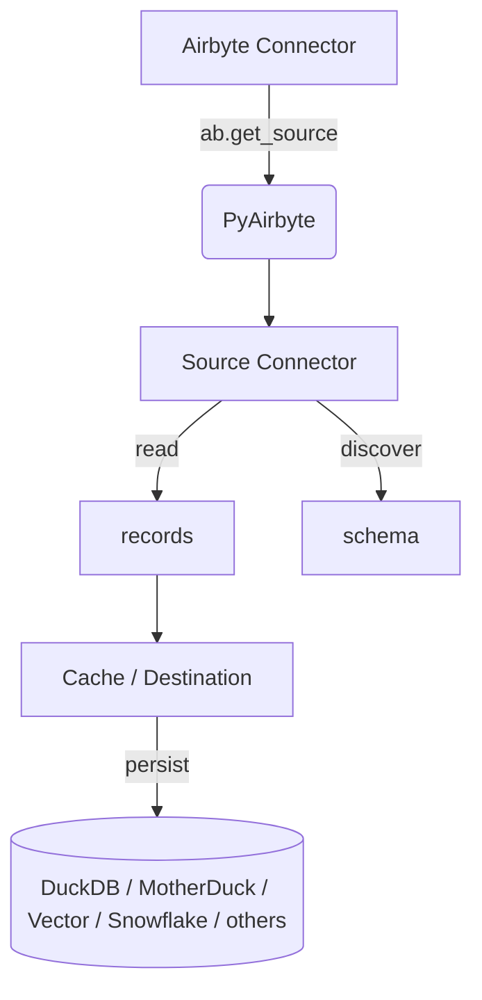

## What is PyAirbyte

PyAirbyte is a lightweight Python interface that lets you run any Airbyte connector directly inside your code. Instead of deploying the full Airbyte platform, you import a library, point it at a source, and start streaming JSON records into the storage option of your choice. The same connectors, schemas, and incremental‑state logic you would use in Airbyte Cloud are available locally, so you can prototype quickly and promote the exact pipeline to production without rewriting.

In short, PyAirbyte brings the Airbyte protocol to wherever Python runs—Jupyter notebooks, scheduled scripts, serverless functions, or long‑lived services—while staying fully compatible with the wider Airbyte ecosystem.

- **Batteries included** – 550 + source & destination connectors.
- **No heavyweight platform** – run from any Python runtime.
- **Declarative** – the API mirrors the Airbyte Connector Spec.
- **Composable** – mix‑and‑match caches, secret managers, and destinations.

### 3.1 How it works How it works

- The **source** streams JSON lines that follow the Airbyte Protocol.
- PyAirbyte writes them to a **cache** (Local DuckDB by default) or forwards them to a destination connector.
- State messages are stored so that the next run fetches only new or updated records (incremental sync).

### 3.2 Limitations

| **Feature**                | **PyAirbyte**                                          |
| -------------------------- | ------------------------------------------------------ |
| Orchestration / scheduling | ❌ – bring your own (GitHub Actions, Airflow, Dagster…) |
| Monitoring & alerting      | ❌ – You can configure it yourself                      |
| Transformations            | ✅ lightweight, Python‑side                             |

